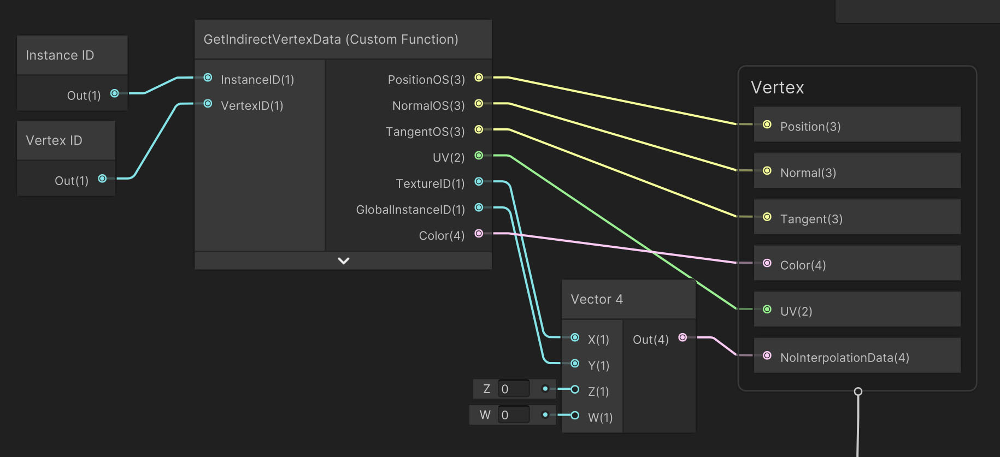
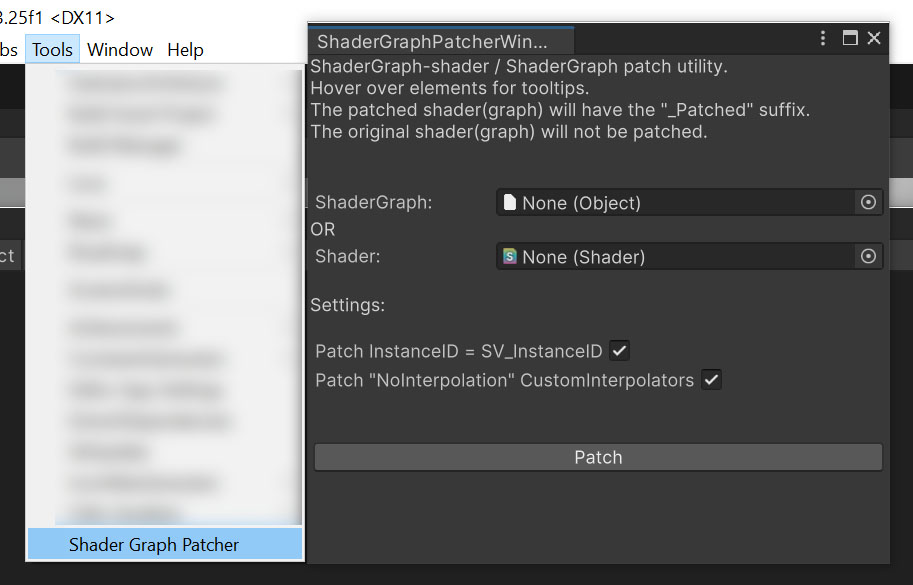

# Unity Shadergraph Patcher

Patcher utility for Unity Shadergraph shaders. 
Adds features to Shadergraph shaders that are currently not available in Shadergraph. 
Tested with Shadergraph 14.0.11 and URP 14.0.11 . HDRP has not been tested.
The SV_InstanceID issue has been fixed in Unity6 and you no longer need to patch it.

### Features

- Use SV_InstanceID instead of unity_InstanceID when using the InstanceID-node. This breaks instancing support for the shader, but in return allows using the shader with IndexedIndirect render functions. i.e. Graphics.RenderPrimitivesIndexedIndirect. NOTE: This has been fixed in Unity6 and you no longer need to patch this.
- Add "nointerpolation" attribute to CustomInterpolators / Vertexshader output
- Support for uint, int, min16uint and min16int vertex input attributes. i.e. "float4 uv2 : TEXCOORD2;" becomes "min16uint4 uv2 : TEXCOORD2;". NOTE: This will **ONLY** patch vertex INPUT! All other nodes/code will not be affected. 

### Patching

When patching a shader, the original shader(graph) will not be touched and a new shader will be created instead. 
The new shader will have the suffix "_Patched". 
i.e. Opaque.shadergraph will become Opaque_Patched.shadergraph 
The name of the new shader will also be changed. 
i.e. "Shader Graphs/Opaque" will become "Shader Graphs/Opaque_Patched"

If patching both SV_InstanceID and nointerpolation, "InstanceID" in the screenshot above will contain SV_InstanceID instead of unity_InstanceID and "NoInterpolationData" will get the "nointerpolation" attribute.

### How To

Copy the "Editor" folder to your Unity project. The patcher will then be available under "Tools/Shader Graph Patcher". 
Drag and drop a shadergraph or shader to the window and select the features you want to patch. 
Then press "Patch"

~ Use at your own risk. ~
