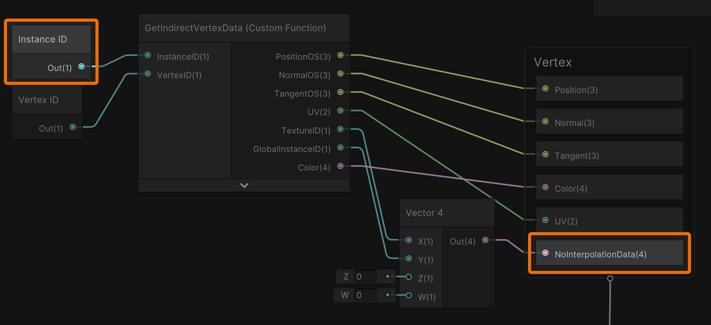

# UnityShaderGraphPatcher
Patcher utility for Unity Shadergraph shaders.
Tested with Shadergraph 14.0.11 .

The patcher currently supports the following features:
- Use SV_InstanceID instead of unity_InstanceID when using the InstanceID-node. This breaks instancing support for the shader, but in return allows using the shader with IndexedIndirect render functions. i.e. Graphics.RenderPrimitivesIndexedIndirect
- Add "nointerpolation" attribute to CustomInterpolators / Vertexshader output

When patching a shader, the original shader(graph) will not be touched and a new shader will be created instead.
The new shader will have the suffix "_Patched".
i.e. Opaque.shadergraph will become Opaque_Patched.shadergraph
The name of the new shader will also be changed.
i.e. "Shader Graphs/Opaque" will become "Shader Graphs/Opaque_Patched"

If patching both SV_InstanceID and nointerpolation, "InstanceID" in the screenshot above will contain SV_InstanceID instead of unity_InstanceID and "NoInterpolationData" will get the "nointerpolation" attribute.

Just copy the "Editor" folder to your Unity project. The patcher will then be available under "Tools/Shader Graph Patcher".
Drag and drop a shadergraph or shader to the window and select the features you want to patch.
Then press "Patch"
